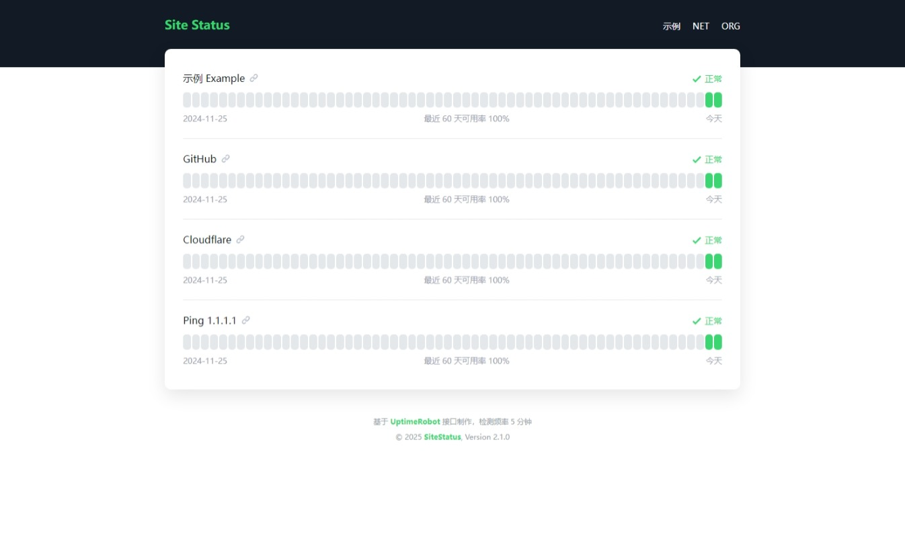

# uptime-status
一个基于 UptimeRobot API 的在线状态面板。

基于 [yb/uptime-status](https://github.com/yb/uptime-status) 项目修改，  
已优化，现已支持设置时间轴方向、页脚信息，API 地址，还能设置导航栏菜单和检测站点的链接属性，还带有 API 代理脚本。



## 预先准备
- 您需要先到 [UptimeRobot](https://uptimerobot.com/) 添加站点监控，并在 [Integrations & API](https://dashboard.uptimerobot.com/integrations) 页面获取 Read-only API key，  
注意是只读 API 密钥，因为接下来密钥将会在代码中暴露，然后保存备用。

  （您也可以一个一个的获取针对单个监视器的只读 API 密钥（Monitor-specific API key），然后按顺序填入配置文件中，这样就可以实现排序了）

- 您需要拥有一个网站空间，常见的 Nginx / PHP 等空间即可，Web 虚拟主机也可以，甚至是对象存储等纯静态空间都行。

  （您也可以使用 Cloudflare Pages 部署并使用接口代理脚本）

## 开始部署
### Cloudflare Pages 部署
1. 分叉此存储库。

2. 修改 `public` 目录下的 `config.js` 文件，  
具体请参考配置文件自带的注释，有详细说明。

3. 部署到 Cloudflare Pages，  
构建命令填写 `npm install && npm run build`，  
构建输出目录填写 `build`，然后保存并部署即可。

进阶功能，您可以查看下方的 `接口代理` => `Cloudflare Pages Functions` 内容来启用 API 代理。

支持缓存、API 密钥映射、隐藏监视器 URL。

### 静态页面部署
- 在 Releases 页面下载并解压缩最新的 `uptime-status.zip` 文件。

- 修改 `config.js` 文件：
  - 具体请参考配置文件自带的注释，有详细说明。

- 将所有文件上传到网站空间，完成。

## 接口代理
### Cloudflare Pages Functions
如果您使用 Cloudflare Pages 部署并想实现接口的代理，  
可以在部署后将 `config.js` 文件的 `ApiUrl` 值修改为 `/api`，并添加环境变量以配置代理脚本。

首先，为了防止代理脚本被他人使用，代理脚本有 API 密钥映射功能，  
还有假设您甚至不想暴露只读 API 密钥，则可以设置环境变量添加 API 密钥 JSON 映射表，  
例如环境变量 `API_KEY_MAPPING`：
```json
{
  "m798253648-35fa331b6cb-9bcdac25e75c": "m798203948-76bd23ae3467d56f20134a1c",
  "m798425196-457aa536ce62ae311f1f8658": "m797019384-bce5d67a90987e75f9b2afc8",
  "m798753368-21cd817d0cd5c407a8bb69ad": "m798625980-86af4a541cf0b703e685bb09",
  "m797578523-47da9245ef2bb9039195e0c4": "m798236801-46c2b4ae5e7e1ffdd88302fd",
  "m797036578-5b07502fdc2b4e586fc9658a": "m798330868-42f19367146d041d3ca7c991"
}
```

在映射表的左边填写在代码中暴露的假密钥，然后在右边填写对应的真密钥，  
当客户端使用假密钥请求 API 代理时，代理脚本会自动找到对应的真密钥来请求 UptimeRobot API，这样就可以实现不在客户端暴露任何的密钥。

---

接下来，您还可以设置环境变量 `HIDE_URL` 为 `true`，这样代理脚本就会在返回中隐藏监视器的 URL 地址以及端口信息（如果有），  
注意这也意味着您无法使用 `config.js` 文件中的 `ShowLink` 设置。

还可以设置环境变量 `HIDE_AUTH` 为 `true`，这样代理脚本就会在返回中隐藏监视器的登录信息（如果有，适用于受密码保护的网页）。

---

然后，如果您希望启用基于 KV 存储的缓存功能，可以在 Cloudflare 存储和数据库页面创建一个 KV 存储，名称随意，您可以识别的就好，  
接着在 Cloudflare Pages 项目设置页绑定 KV 存储，变量名填 `KV`。

最后添加环境变量 `KV_TTL` 设置缓存的有效期，单位为秒，默认为180秒，完成。

### Nginx
如果您想使用 Nginx 搭建接口的代理，可以参考以下配置文件：
```nginx
server {
  listen [::]:80;
  server_name api.example.com;
  location / {
    proxy_ssl_server_name on;
    proxy_pass https://api.uptimerobot.com/;
    proxy_hide_header Access-Control-Allow-Origin;
    add_header Access-Control-Allow-Origin * always;
  }
}
```
然后按照实际情况修改 `config.js` 文件中的 `ApiUrl` 设置。

## 许可证
本项目基于 [yb/uptime-status](https://github.com/yb/uptime-status) 修改而来。原项目未在根目录直接提供许可证文件，而是在 `package.json` 中声明其许可证为 MIT。

本项目同样采用 MIT 许可协议进行开源。

本项目中的 [LICENSE](./LICENSE) 文件由 [molikai-work](https://github.com/molikai-work) 依据 [yb/uptime-status](https://github.com/yb/uptime-status) 的 `package.json` 许可声明创建，并参考该仓库的提交记录补充了相关版权信息。
